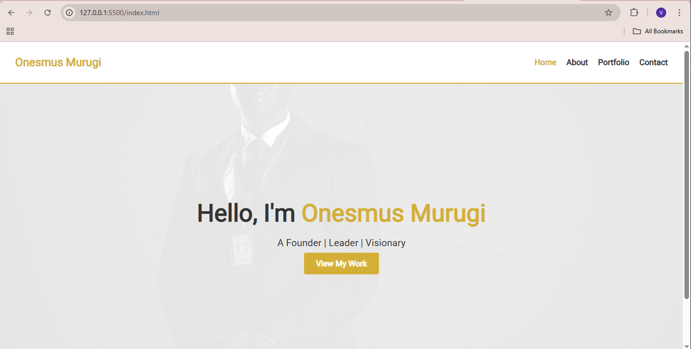

# Onesmus Murugi – Personal Portfolio Website

Welcome to the personal portfolio of **Onesmus Murugi**, a passionate founder, leader, and visionary. This website showcases his professional background, achievements, community initiatives, and ways to get in touch.

## 🌐 Live Site

👉 [View the Website](https://vanessasy.github.io/onesmus-portfolio/)

---

## 📁 Project Structure

onesmus-portfolio/
├── index.html
├── about.html
├── portfolio.html
├── contact.html
├── css/
│ └── style.css
├── images/
│ └── hero.jpg, portfolio items, etc.
└── js/
└── script.js (optional)

---

## 🎯 Features

- **Sticky Navigation Bar**  
  Easy site navigation with highlight on the active page.

- **Hero Section with Call to Action**  
  Eye-catching intro with a link to portfolio work.

- **About Page with Scroll Animations**  
  Smooth fade-in animations and inspirational quote block.

- **Portfolio Section**  
  Visually appealing layout to showcase key projects and initiatives.

- **Contact Form**  
  Simple form to reach out with inquiries or messages.

- **Responsive Design**  
  Optimized for mobile, tablet, and desktop devices.

- **Modern Gold & White Theme**  
  Elegant, clean visual design reflecting leadership and professionalism.

---

## 🛠️ Technologies Used

- HTML5
- CSS3
- JavaScript (optional enhancements)
- Google Fonts – Roboto
- GitHub Pages for deployment

---

## 📸 Screenshot

---

## 📬 Contact

For inquiries, collaborations, or feedback, please use the [Contact Page](contact.html) on the site.

---

## 📄 License

This project is open-source and free to use for educational or personal purposes. Feel free to customize it!

---